# Visual Parity Audit — Cardano DRep Coordination Platform

**Date:** 2026-05-01
**Design source:** `style-assets/design_handoff_drep_platform/design_files/` (Babel + JSX prototype, served at `http://localhost:8765`)
**Live deployment:** `https://drep.tools`
**Capture rig:** Headless Chrome for Testing 134, 1440×900 / 390×844, DPR 2. Sampled values are computed CSS read via CDP (see `.design-audit/cdp_shoot.js`). Numbers are measured, not estimated.

---

## TL;DR

Live is a **wireframe-grade** implementation. IA partially in place; visual system almost entirely skipped — no Cardano Blue buttons, no card shadows or radii, no hero band, no stat tiles, no sentiment bars, no donut. The `#0033AD` brand color is in the CSS palette but used by exactly two elements (an eyebrow label and an empty epoch number).

**Overall fidelity: 3 / 10.** Skeleton matches; everything that makes the design feel like a designed product is missing.

---

## 1. Landing / guest view

| Design (Clubhouse, hero flow) | Live (`/`) |
|---|---|
| 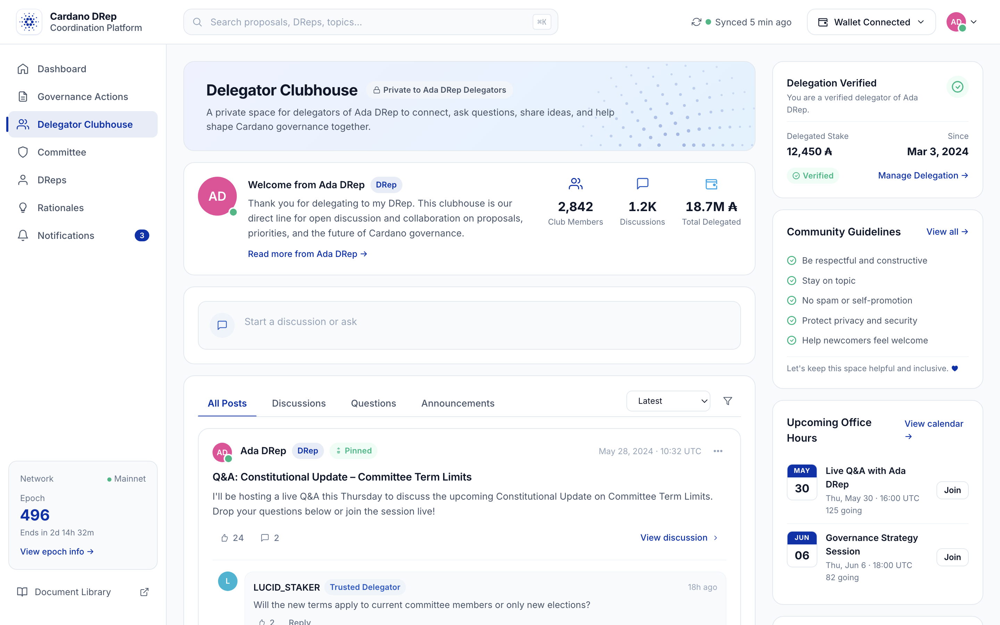 | 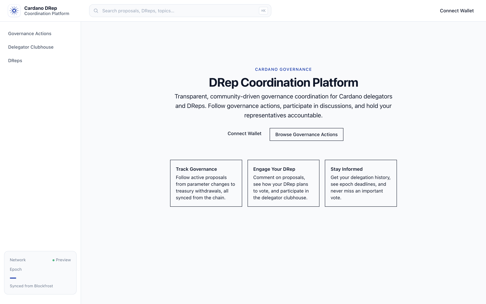 |

Prototype boots into Delegator Clubhouse (README's "hero flow"); live lands on a marketing home.

- ❌ **Primary CTAs unstyled.** Live "Connect Wallet": `bg: rgba(0,0,0,0)`, `color: rgb(15,23,42)`, `border: 0px none`, `radius: 0px`. Design `.btn--primary`: `bg: rgb(0,51,173)` / white / `radius 8px` / weight 600 / shadow-sm. The brand-blue filled button is absent everywhere.
- ❌ **No hero band, no stat tiles, no Hot Actions table.** Design has tinted hero card, 4 stat tiles in `repeat(auto-fit,minmax(180px,1fr))`, hot-actions table with sentiment cells. Live `/` has zero of each.
- 🟡 **Topbar pattern matches.** Search sampled `bg: rgb(248,250,252)`, `radius: 12px`, `font-size: 13.5px` — matches. Topbar 64px vs design 60px.
- 🟡 **Sidebar half-built.** 240px / white (matches), but **3 of 7 nav items** ship; missing Dashboard, Committee, Rationales, Notifications. All links `hasIcon: false`.
- 🟡 **Epoch card empty.** Number is `—`; design shows `496` as 24px/700 brand-blue with countdown.

---

## 2. Governance list

| Design | Live |
|---|---|
| 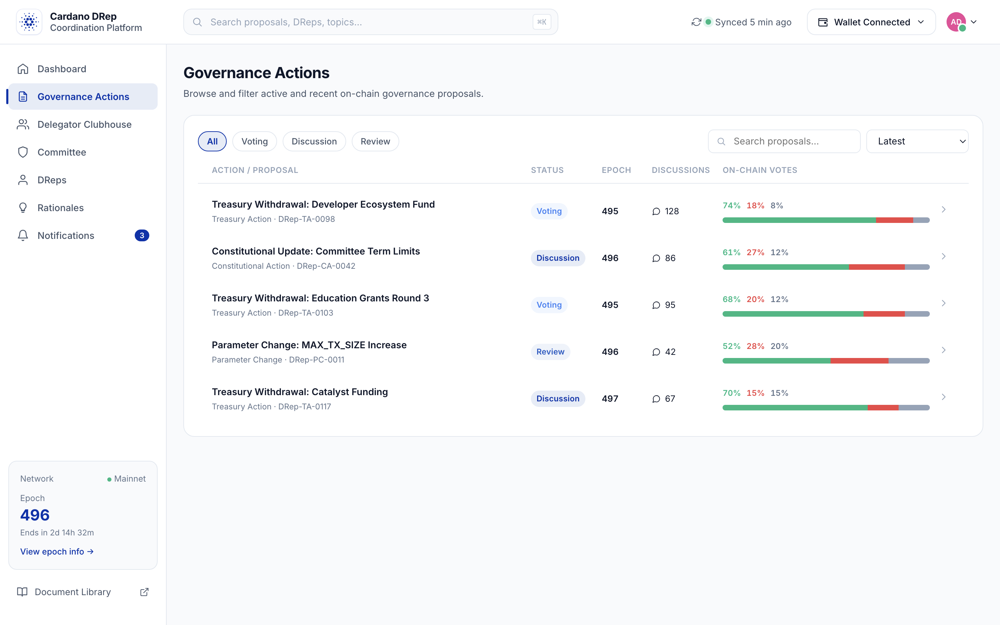 | 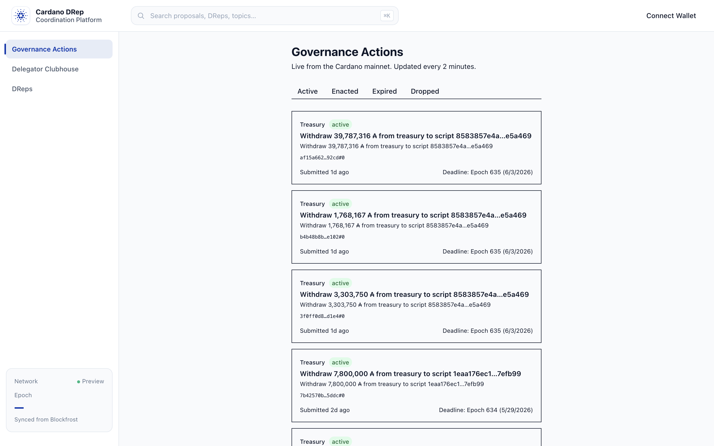 |

Closest pair conceptually; choices diverge.

- ❌ **Design uses a *table*; live uses *stacked cards*.** Design: 6-column grid (Action / Status / Epoch / Discussions / **sentiment bar** / chevron). Live: one card per row, ~504px wide. The sentiment-bar column — what makes it look governance-y rather than explorer-y — is the most missed piece.
- ❌ **No sentiment bars at all.** Design rows carry a 3-segment bar with `74% / 18% / 8%`. Live: no vote tally.
- ❌ **Card chrome wrong.** Live row: `radius: 0px`, `shadow: none`, `border: 1px solid rgb(15,23,42)` (`#0F172A`). Design wants `radius 12`, `shadow-sm` lifting to `shadow-md` on hover, `border #E2E8F0`. Hard near-black borders make cards look "outlined" not "elevated."
- 🟡 **Title weight roughly right** — live 14px / 600 vs design 17px / 600. Runs ~3px small.
- ✅ **Filter chips present** (Active / Enacted / Expired / Dropped vs All / Voting / Discussion / Review / Passed / Failed — different vocab, same pattern).
- ✅ **Status pill shape matches.** Live "active": `bg: rgb(220,252,231)` (green-100), `color: rgb(22,101,52)` (green-800), `radius: 9999px`. Design `--success-soft` / `--success` — different shade, same shape.

### Mobile

| Design | Live |
|---|---|
| 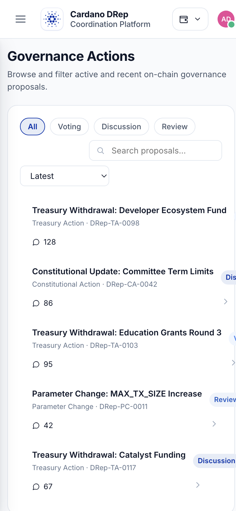 | 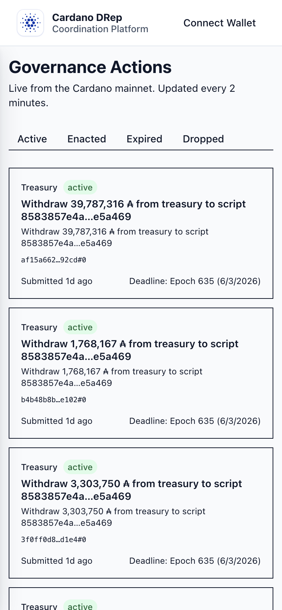 |

Both stack to one column. Same radius/shadow/sentiment deltas. Live status pills overflow the right edge — a width-specific layout bug.

---

## 3. Proposal detail

| Design | Live |
|---|---|
| 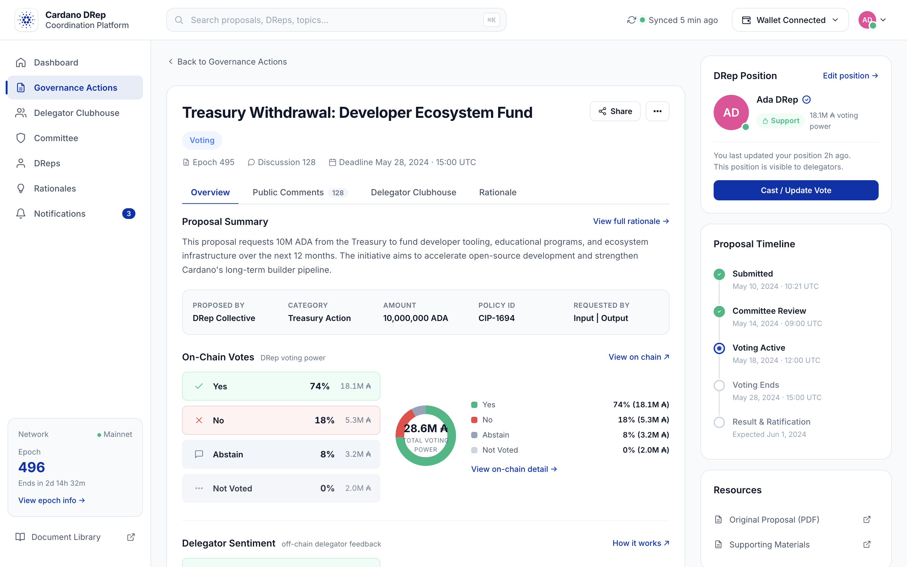 | 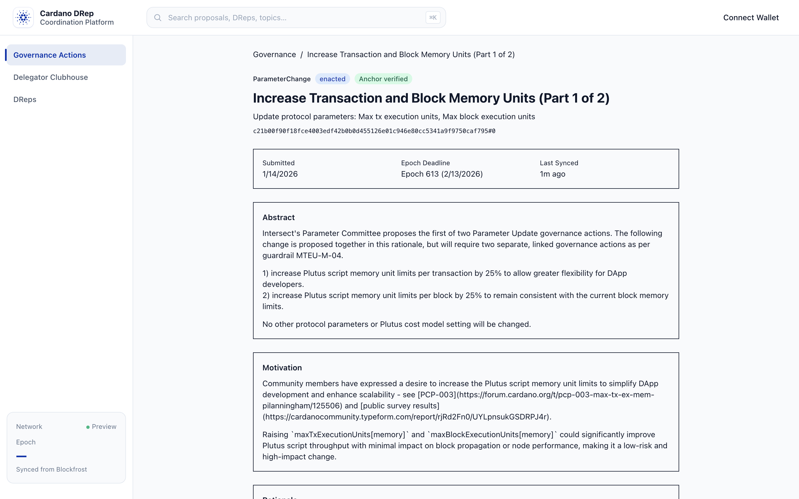 |

Best-implemented surface; still far from the design.

- ✅ **Anchor metadata renders correctly.** Live shows full Abstract / Motivation / Rationale from the on-chain anchor — real product value the prototype only stubs.
- ❌ **No hero card.** Design: 28px-padded hero with title 24px/700, status pill cluster, `epoch · discussions · deadline` meta row. Live: bare layout.
- ❌ **No tabs.** Design: Overview / Public Comments / Delegator Clubhouse / Rationale. Live: one long scroll.
- ❌ **No On-Chain Votes block.** Design: 3-col block (stacked Yes/No/Abstain/Not-Voted cards | 140px donut "28.6M ₳ Total voting power" | legend). Live: nothing.
- ❌ **No Delegator Sentiment block** (twin using Approve/Disapprove/Abstain/Not-Voted vocab). Absent.
- ❌ **No right rail.** Design rail: Cast Vote, DRep position chip, top supporters/opposers, resources. Live: single column.
- 🟡 **Anchor sections rendered as plain bordered boxes** (hard near-black borders, 0 radius, no fill differentiation).

---

## 4. Topbar / sidebar / chrome

| What works ✅ | What's missing ❌ |
|---|---|
| Brand mark tile + two-line wordmark | Sync indicator pill ("Synced 5 min ago" + pulsing dot) |
| Centered `bg-muted` search, 12px radius, cmd+K hint | Notification bell with red-dot badge |
| Sticky topbar, 64px, subtle bottom border | Wallet chip with avatar + abbreviated address + caret |
| Sidebar 240px wide, white bg, sticky | 4 of 7 nav items (Dashboard / Committee / Rationales / Notifications) |
| Epoch card scaffolding present | Sidebar icons (lucide-style 18px stroke-2) |
|   | Active nav state (`bg-primary-soft` + 3px left-border + brand-primary text) |
|   | Epoch number (`—` instead of `496`), epoch link, Document Library link |

---

## 5. Light vs dark

The live app **has no theme toggle**: `document.documentElement.dataset.theme` is undefined; no DOM button matches `/theme|dark|light|toggle/`. Design ships a complete dark palette in `styles.css` under `[data-theme="dark"]`.

| Design — light | Design — dark |
|---|---|
| 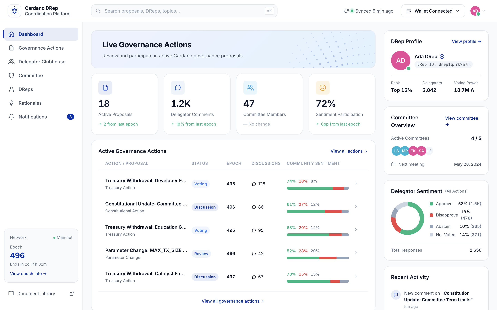 | 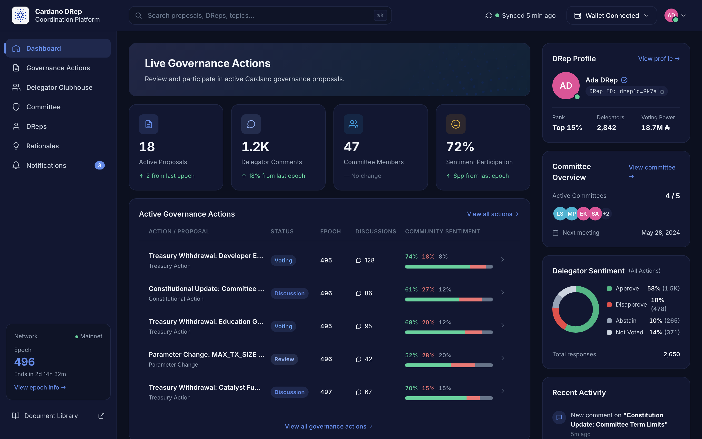 |

❌ **Live is light-only.** Per spec the toggle should land in the user-settings dropdown and persist to `localStorage`.

---

## 6. Mobile

| Design clubhouse 390 | Live home 390 |
|---|---|
| 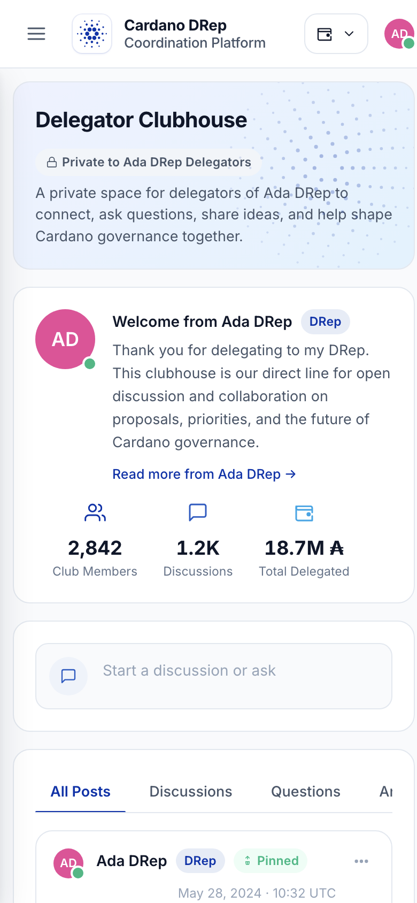 | 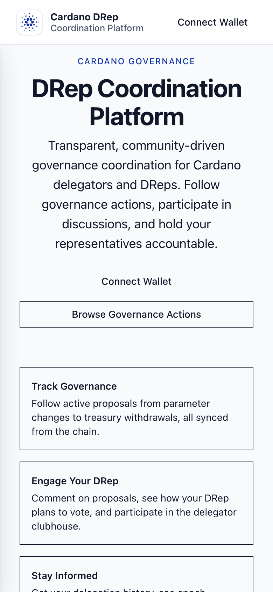 |

- ✅ **Both collapse to one column.** Topbar reflows correctly.
- 🟡 **No hamburger / drawer on live.** Design shows a hamburger that opens a sidebar drawer. Live just hides the sidebar at this width — leaving the missing routes unreachable.

---

## Numeric evidence summary

| Property | Design | Live | |
|---|---|---|---|
| Primary button bg | `rgb(0,51,173)` | `rgba(0,0,0,0)` | ❌ |
| Primary button radius | `8px` | `0px` | ❌ |
| Primary button weight | `600` | default | ❌ |
| Card border-radius | `12–16px` | `0px` | ❌ |
| Card shadow | shadow-sm | none | ❌ |
| Card border color | `#E2E8F0` | `#0F172A` | ❌ |
| Search input radius / bg | `12px` / `#F8FAFC` | `12px` / `rgb(248,250,252)` | ✅ |
| Body font | Inter, system-ui | Inter, system-ui | ✅ |
| Topbar height | 60 px | 64 px | 🟡 |
| Sidebar width | 240 px | 240 px | ✅ |
| Sidebar nav items | 7 | 3 | ❌ |
| Sidebar icons / active state | yes / yes | none / none | ❌ |
| Brand color usage count | many | 2 | ❌ |
| Theme toggle | yes | none | ❌ |
| Status pill shape | rounded-full + soft bg | rounded-full + soft bg | ✅ |
| Hero band | yes | none | ❌ |
| Stat tiles | 4 in auto-fit grid | none | ❌ |
| Sentiment bars in list | yes | none | ❌ |
| Donut chart | yes | none | ❌ |

---

## Top 5 gaps (prioritised)

1. **Brand-primary buttons.** Connect Wallet / Browse / Cast Vote / Post / Reply → solid `#0033AD` / white / radius 8 / weight 600 / hover `#002789`. Ship the shadcn `Button default` variant globally. Highest user impact.
2. **Card chrome.** Replace `border 1px #0F172A / radius 0` with `bg-surface / border 1px #E2E8F0 / radius 12-16 / shadow-sm` lifting to shadow-md. Touches every governance row + anchor section.
3. **Sidebar nav completion.** Ship Dashboard / Committee / Rationales / Notifications, add 18px lucide icons (Home / Shield / Lightbulb / Bell), add active state. Without this, two of four primary surfaces are unreachable.
4. **Sentiment bars + donut.** 3-segment bar in list, 140px donut + legend on detail. The actual *governance* product surface — without these the platform looks like a generic explorer.
5. **Hero band + stat tiles.** Tinted hero card + 4-tile `auto-fit minmax(180px,1fr)` grid. Turns landing from marketing splash into working tool.

(Smaller gaps left off: dark-mode toggle, mobile hamburger, sync indicator, recognized-delegator gold star, public-comments composer, full Clubhouse build-out.)

---

## Honest assessment

**Design followed loosely.** The implementer has read the spec — Inter, 240px sidebar, `--bg-subtle` search, `#F8FAFC` page bg, rounded-full pills, `#0033AD` in the palette — all show up. But the visual system stops there. None of the *characteristic* components — Cardano-blue filled buttons, elevated rounded cards, sentiment bars, donut charts, hero bands, stat tiles, dark mode, recognized-delegator badges — are shipped. The Delegator Clubhouse, the README's "hero flow," is wallet-gated and presumably empty.

Closest analogy: someone built the HTML and routes, then shipped before applying the design system on top. Closing gaps 1–3 lifts fidelity from 3 to ~6 in a few hours; gaps 4–5 are component builds.
